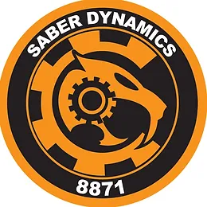

 Navigating the Robotics Realm: A Practical Reflection on My Role at Saber Dynamics

Introduction:

Stepping into the shoes of the Head Programmer at Saber Dynamics, I was thrust into a world where lines of code dictated the movements of robots. This essay aims to provide a down-to-earth account of my experiences, highlighting the challenges and successes that marked my tenure in this dynamic role.

# Programming at the Core

My primary task revolved around developing the robot's control system. It wasn't about grandiose visions; it was about getting the code right so the robot could do its job efficiently. Late nights were spent tweaking and optimizing, turning abstract algorithms into tangible movements.

# Autonomous Adventures

Crafting autonomous capabilities for the robot was both a headache and a thrill. Watching the robot make decisions on its own was like seeing a kid ride a bike for the first time. It took a lot of trial and error, but the end result was satisfying in its simplicity – the robot doing what it was supposed to do without a hitch.

# Teaching the Tech

Leadership was an unexpected but essential part of the job. I found myself training the electronics team on the nitty-gritty of electrical and pneumatic systems. Mostly just hands-on sessions to make sure everyone knew their way around the tech. It was about sharing what I knew and making sure the whole team could contribute.

# Pragmatic Problem-Solving

In the world of robotics, problems were a daily affair. Debugging code and fixing hardware glitches became routine. The goal was never to find the most groundbreaking solution but to find a practical one that got the job done. It was about making the robot work, not reinventing the wheel.

# The Regional Win

The pinnacle of our efforts was the FRC Regional Tournament win. It wasn't a story of heroic proportions; it was the result of everyone putting in the hours and doing their part. The victory was sweet, not just for the accolade but for the shared sense of accomplishment among the team.

# Conclusion:
Being head programmer at Saber Dynamics was massively influential to me. I had just moved to Hawaii, and COVID restrictions had just ended, so this was one of the first things I accomplished coming out of a tulmultuous time in my life. It meant a lot to me that I could come to robotics every day to just work and talk with my friends. 

--GPT assisted in clean-up of this essay

Source: <a href="https://github.com/lucashorsman">lucashorsman/8871</a>
