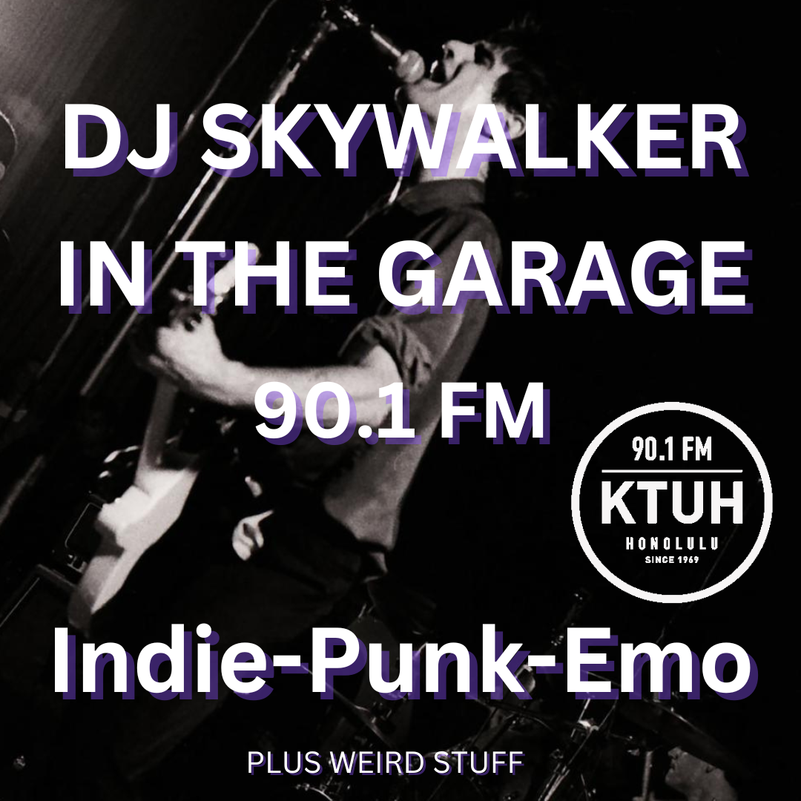

This script automates the creation of a Spotify playlist by extracting songs from a Spinitron show. Users can provide a Spinitron show URL (e.g., [https://spinitron.com/KTUH/pl/18030348/In-The-Garage](https://spinitron.com/KTUH/pl/18030348/In-The-Garage)), and the script will gather all the songs from that show and generate a corresponding playlist in their Spotify account.

Why?

I am a DJ with KTUH. I made this tool to assist me and other DJ's in automating their playlist generation, with the intention of making these playlists for members of the community, increasing the level of engagement a listener can have with the show. As a KTUH DJ, we don't typically use a playlisting software but instead rely on a primarily physical collection of music. This meant that making a playlist for preservation or sharing often involved a tedious process of taking note of each song played then adding it to a Spotify playlist. 

How?

This script looks at the spinitron page for a show, decodes some HTML on the page to get the song title and artist name for each song played during the show timespan. Next, it uses spotipy, which is a python library that interfaces with the Spotify API, to 'search' for each of these songs using the text from earlier. Meaning, it finds each of the songs inside spotify's database. Once a match for each song is found, it is added to a new playlist on the user's Spotify account. It's pretty fun to watch it populate.

<pre>
</pre>

Source: <a href="https://github.com/lucashorsman/SpinitronPlaylistGenerator"><i class="large github icon "></i>lucashorsman/SpinitronPlaylistGenerator</a>
