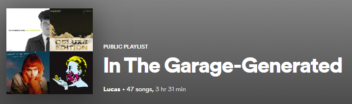

The Spotify Liked Artist Playlist Generator is a Python script designed to enhance your music listening experience on Spotify.

# Functionality and User Interaction
By scanning through your liked songs on Spotify, the script creates dedicated playlists for your favorite artists. The process begins by prompting the user to enter the name of the artist for whom they want to generate a playlist. The script then searches for the artist using the Spotify API and retrieves the artist's unique identifier (URI).

# API Integration and Playlist Creation
After obtaining the artist's URI, the script creates a new public playlist with a name formatted as "Liked Songs by [artist]" and a corresponding description. It then collects the user's liked songs and adds the ones by the specified artist to the playlist. Additionally, the script provides an option to add the top 10 songs of that artist to the playlist, enhancing the variety and depth of the curated collection.
# Credential Requirements and Spotipy Library Usage
To use this script, users need to have Spotify API credentials, including a client ID and client secret, which can be obtained by creating a Spotify Developer account. The script utilizes the Spotipy library to interact with the Spotify API and prompt users for necessary information. 

Overall, the "Spotify Liked Artist Playlist Generator" simplifies the process of creating personalized playlists based on your favorite artists, providing a more tailored and enjoyable listening experience on Spotify.
<pre>
</pre>

Source: <a href="https://github.com/lucashorsman/SpinitronPlaylistGenerator"><i class="large github icon "></i>lucashorsman/SpinitronPlaylistGenerator</a>
